#Modern Robotics
> [官网](http://hades.mech.northwestern.edu/index.php/Modern_Robotics)
> 
> [美国西北工业大学](https://www.bilibili.com/video/BV1KV411Z7sC?p=4&vd_source=1dc1f5616fa7bc05e0def8e62f42c924)
> 
> [指导](https://zhuanlan.zhihu.com/p/143372318)
> 
> [笔记参考](https://www.zhihu.com/column/c_1308153272536707072?utm_id=0)
---
##Chapter 2
1. 刚体自由度的计算

* 以3维空间为例，对于刚体中一个点A，其坐标可表示为(x,y,z)，故有3个真实自由度
* 对于刚体中另一个点B，由于其与A的距离不会改变，所以B的位置受到1个约束，故只有2个真实自由度
* 对于刚体中的点C，由于其受A和B这2个约束，故其真实自由度为1
* 故一个刚体在三维空间中自由度为3+1+1=6
* 也可以理解为是3个位置自由度加3个角度自由度
* 于是可推出2维空间自由度为2+1=3个自由度，其中2个位置自由度，1个角度自由度
* 4维空间自由度为4+3+2+1=10个自由度，其中4个位置自由度，6个角度自由度
2. 机器人的自由度
* 若干种类型的关节的自由度

* 计算机器人自由度公式——Grubler's formula
$$dof=m(N-1-J)+\sum^{J}_{i=1}f_i$$
其中三维刚体时m=3，二维刚体时m=2；N为包括基座的刚体数量；J为关节数量；$f_i$为第i个刚体的真实的自由度数量（也就是1.中的图中的real freedom）
> 三关节开链机械臂 $dof=3(4-1-3)+3=3$
>

> 三关节闭链机械臂 $dof=3(4-1-4)+4=1$ （由于两个基座始终相对位置不变，故只算作1）
>

##Chapter 3

* 李群属于群论的一部分，李群（Lie group）是具有群结构的实流形或者复流形，并且群中的加法运算和逆元运算是流形中的解析映射
* 常见的李群有接下来也会提到的SO(2)、SO(3)等

1. 旋转矩阵

> SO(3)表示三维的特殊正交群——群中任意两个向量的内积为0
> 
> $R_{cs}=R_{sc}^{-1}=R_{sc}^T$ ==（其中sc表示c相对于s，$R_{sc}$ is the orientation of {c} relative to {b}）==
> 

* 旋转矩阵的三种用途：
  *  表示姿态（如坐标系a相对于坐标系b的姿态）
  *  改变某个向量或坐标系的参考系（$R_{sc}=R_{sb}R_{bc}$）
  *  旋转一个向量或坐标系（$p_{s}=R_{sb}p_{b}$）
> 三种用途的例子
> 
> * representing the orientation: $R_{ac} = \begin{bmatrix} 0 & -1 & 0 \\ 0 & 0 & -1 \\ 1 & 0 & 0 \end{bmatrix}$
> * changing the reference frame: $R_{ac}=R_{ab}R_{bc}$，$p_{a}=R_{ab}p_{b}$
> 
> 
> * rotating a vector or a frame: 对于旋转算子R=Rot($\hat{z}$,90°)，其意思是围绕z轴旋转90度
>   * 当$R_{sc}$左乘R时，是围绕参考坐标系s的z轴旋转90度
>   * 当$R_{sc}$右乘R时，是围绕自身坐标系c的z轴旋转90度
>   * 由于向量$p_{a}$只涉及到一个坐标系{a}，故$p_{a}$左乘R时，相当于围绕a的z轴旋转90度，$p'_{a}=Rp_{a}$

2. 角速度

* 其中$\hat{\omega}_s$是单位旋转向量轴，$\dot{\theta}$是旋转速率，那么$\omega_s=\hat{\omega}_{s}\dot{\theta}$就是角速度向量
* 那么坐标轴$\hat{x}$的角速度为$\dot{\hat{x}}=\omega_{s}\times\hat{x}$，剩余两个轴也类似，其中$\times$表示外积

* $x\times{}y=x^{-1}y=-y^{-1}x$可化成$[x]y$，其中$[x]$是反对称矩阵
* $[x]\in{}so(3)$，so(3)表示反对称矩阵的集合
* $[x]=-[x]^T$
* $R[\omega]R^T=[R\omega]$

* 由于$R_{sb}$的每一列表示{b}的某坐标轴相对于{s}的旋转情况，故$\dot{R}_{sb}$的每一列表示{b}的某坐标轴相对于{s}的旋转角速度，则$\dot{R}_{sb}=\omega_{s}\times{}R_{sb}=[\omega_{s}]R_{sb}$，$\dot{R}_{sb}=R_{sb}\times{}\omega_{b}=R_{sb}[\omega_{b}]$
* $\omega_s=R_{sb}\omega_b$
* $[\omega_b]=R_{sb}^{-1}\dot{R}_{sb}$，$[\omega_s]=\dot{R}_{sb}R_{sb}^{-1}$

3. 旋转的指数坐标（Rodrigues' formula）

我们将$\hat{\omega}\theta$定义为旋转的指数坐标，对于旋转矩阵R的指数坐标$\hat{\omega}\theta$，我们可有三种解释：

（1）表征旋转，在参考系{s}下，姿态的初始状态与{s}重合，围绕$\hat{\omega}$这个单位向量转动角度为$\theta$后，位姿的最终姿态可用R表示

（2）表征旋转角速度，在参考{s}下，姿态的初始状态与{s}重合，$\hat{\omega}$为旋转轴，旋转速度为$\hat{\omega}\theta$，经历一个单位时间后的位姿可用R表示

（3）表征旋转角速度，在参考{s}下，姿态的初始状态与{s}重合，$\hat{\omega}$为旋转轴，旋转速度为$1$，经历$\theta$个单位时间后的位姿可用R表示

* 现在我们要求向量p绕轴$\hat{\omega}$旋转$\theta$度后的向量，这一过程可认为旋转速率为1下绕$\hat{\omega}$旋转了时间为$\theta$，即从t=0到t=$\theta$
* p的旋转角速度为$\dot{p}=\hat{\omega}\times{}p$，进一步可写成$\dot{p}=[\hat{\omega}]p$，求出方程的解为上图最后一个公式，由于$\theta$为标量，故可放进去中括号里面
> 指数矩阵
> 
> 由下面的公式可推广到旋转上
> 
> 
> 
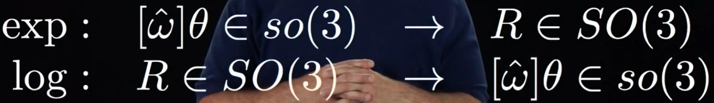
* 罗德里格斯公式及其逆运算
* 正（指数）运算：已知旋转的指数坐标（旋转轴的方向和旋转角度），求旋转矩阵，即使用上上图中黄色框框住的公式求
* 逆（对数）运算：已知旋转矩阵，求旋转的指数坐标（旋转轴的方向和旋转角度）
> 例题
> 
> 所以说表征姿态可有两种方法，一种是旋转矩阵R，一种是旋转指数坐标$\hat{\omega}\theta$，且它们可相互转化
4. 齐次变换矩阵

* SE(3)就是三维的特殊欧几里得群

* 齐次变换矩阵的三种用途
  * 表示刚体位置和姿态（位姿）
  * 改变某向量或坐标系的参考系（$T_{sc}=T_{sb}T_{bc}$，$T_{cs}=T_{sc}^{-1}=T_{bc}^{-1}T_{sb}^{-1}$，$T_{ab}p_{b}=p_{a}$）
  * 移动和旋转一个向量或坐标系（$[p_s;1]=T_{sb}[p_b;1]$）

* 转换算子T其实可分解为平移矩阵乘上旋转矩阵
* 某个$T_{sb}$左乘T，相当于以{s}为参考系，也就是参考{s}先旋转后平移
* 某个$T_{sb}$右乘T，相当于以{b}为参考系，也就是参考{b}先平移后旋转
5. 运动旋量

正如旋转矩阵直接对时间的导数并不是角速度，变换矩阵直接对时间的导数也不是刚体速度

* 刚体速度由一个线性分量和角度分量组成，其可等效于绕某个螺旋轴运动的瞬时速度
* 螺旋轴由三个变量定义：轴上一点p，轴方向上的单位向量$\hat{s}$，螺旋的螺距h
* 螺距h=沿轴的线速度/绕轴的角速度
* $\dot{\theta}$表示物体绕螺旋轴转动的角速度

* 我们更常使用这个6维向量定义螺旋轴S（6*1），注意这里的坐标系是跟随螺丝运动的（包括平移和旋转）
* $S_{\omega}$是$\dot{\theta}=1$时的单位角速度（3*1）
* $S_{v}$是$\dot{\theta}=1$时坐标系原点的线速度（3*1），对于这一项又可分为两小部分，第一部分是$h\hat{s}\dot{\theta}$，是线速度沿螺旋轴的位移，第二部分是$-\hat{s}\times{}q\dot{\theta}$，这是由于旋转运动而造成的线速度

* 运动旋量就可以定义为螺旋轴乘上物体绕螺旋轴转动的角速度

举个例子，其中假设螺距h为0（相当于螺丝在原地旋转，没有推进）

当螺距h为$\infty$（相当于只推进不旋转）和有限的时

运动旋量的坐标转换

* se(3)表示三维的特殊欧几里得矩阵集合
* 左上角的$（3*3）$矩阵是角速度的反对称矩阵，右上角的$（3*1）$向量是坐标系原点处的线速度，最下面一行是4个0
* 这里的中括号[]重定义，在角速度时表示的是反对称矩阵，在这里表示的是运动旋量的矩阵表示法（本来它是个6*1的向量）

> Rotations 与 Rigid-Body Motions 的联系
> 
> 旋转矩阵R -- 变换矩阵T
> 
> 旋转轴$\hat{\omega}$ -- 螺旋轴$S$
>
> 角速度$\omega=\hat{\omega}\dot{\theta}$ -- 运动旋量$V=S\dot{\theta}$
>
> 旋转指数坐标$\hat{\omega}\theta$ -- 刚体运动指数坐标$S\theta$

6. 刚体运动的指数坐标

7. 力旋量

* 其中moment是力矩，wrench是力旋量

* 功率power的大小与参考系无关，故无论基于任意一个坐标系，运动旋量的转置乘上力旋量得到的功率保持不变

* 以机械手加持苹果为例进行分析

##Chapter 4

对于链式机械臂，正向运动即是给定各个关节的角度$\theta$后，求出坐标系{b}相对于坐标系{s}的变换矩阵$T_{sb}(\theta)$，可简写为$T(\theta)$

1. 以基坐标{s}为关节螺旋轴的参考系下求$T_{sb}(\theta)$

步骤如下

（1）设置全部关节变量都为0下的{b}相对于{s}的变换矩阵，注意这个M是{b}相对于{s}下求出的

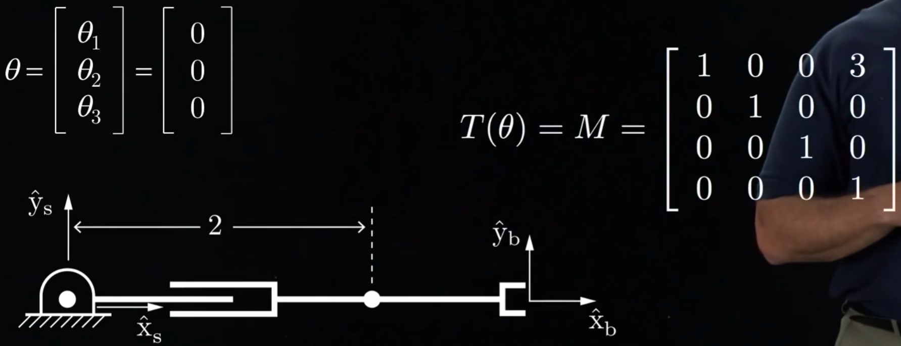

（2）考虑关节3

关节3的螺旋轴$S_3$指向屏幕外，与{s}的z轴方向相同

（3）考虑关节2

关节2的螺旋轴$S_2$方向与{s}的x轴方向相同

（4）考虑关节1

关节1的螺旋轴$S_1$方向与{s}的z轴对齐

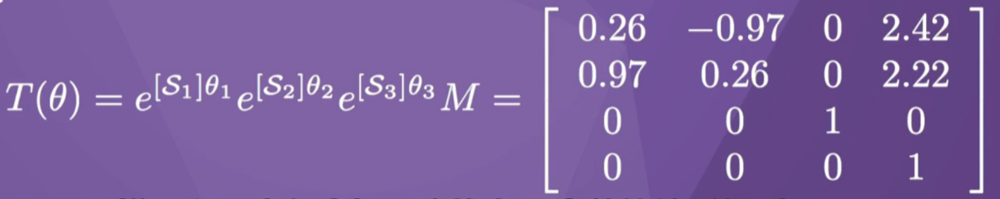

2. 以末端坐标{b}为关节螺旋轴的参考系下求$T_{sb}(\theta)$

步骤如下

（1）设置全部关节变量都为0下的{b}相对于{s}的变换矩阵，注意这个M是{b}相对于{s}下求出的

（2）考虑关节1

关节1的螺旋轴$B_1$指向屏幕外，与{b}的z轴方向相同

（3）考虑关节2

关节2的螺旋轴$B_2$方向与{b}的x轴方向相同

（4）考虑关节3

关节3的螺旋轴$B_3$方向与{b}的z轴对齐

##Chapter 5

1. 速度运动学

* 右边的$m\times{}n$矩阵为雅可比矩阵，m是机械臂末端的维度，n是机械臂关节的数量
* 雅可比矩阵每一列表示，在该关节角速度为1且其他关节角速度为0的情况下，能够产生的末端速度
* 雅可比矩阵矩阵联系了关节速度和末端速度，也可以联系了关节力矩和末端力旋量
* $\theta$取值不同时$J$的取值也不同，物理意义表示为当关节角度为$\theta$的情况下的关节单位转动角度的末端速度

* 当机械臂的关节速度都达到最大时（图左边的正方形的右上角），通过$J(\theta)$可将其映射到末端速度上，表现为图右边，$\theta$不同时，该末端速度上的平行四边形也不同

* 平行四边形换为椭圆后，就可称为可操作度椭圆，右图展示了不同$\theta$下的可操作度椭圆
* 右上图的椭圆表明机械臂可以快速地向左上方运动，而只能缓慢地向右上方移动
* 当机械臂处于奇异点时，椭圆退化为一条线段

2. 静力学

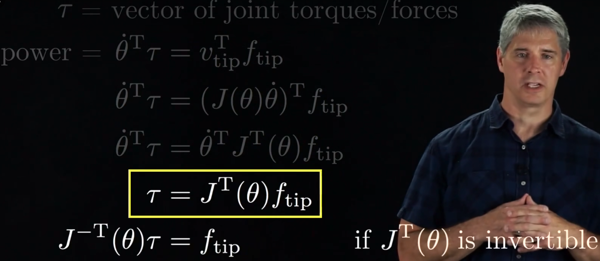

* 根据功率公式可求出关节力矩与末端力的关系

* 可以使用雅克比转置的逆$J^{-T}(\theta)$，将关节力矩的极限映射到末端力的极限
* 在该位形下，机械臂可以向右上方施加较大的力，但能向左上方施加的力要小得多

* 平行四边形换为椭圆后，就可称为力椭圆

* 在之后的学习中，会将末端速度表示为以{s}或{b}为参考系的运动旋量，并导出一个不同的雅可比矩阵
* 将末端力表示为以{s}或{b}为参考系的力旋量

3. 空间雅可比矩阵

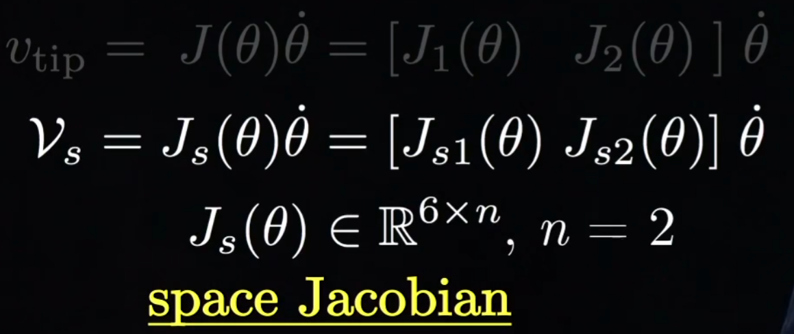

* 末端运动旋量在参考系{s}表示，其所对应的雅可比矩阵就是空间雅可比矩阵$J_s$
* 以二连杆机械臂为例，$J_s$可以分为两列，每一列是该关节速度为1，其他关节速度为0时的末端运动旋量

基本步骤

以求五连杆的空间雅可比矩阵中的$J_{s3}$为例

(1)考虑关节5、关节4、关节3

* 当关节5转动$\theta_5$后，由于关节5不在关节3和{s}之间，因此关节3和{s}之间的位置关系不受关节5影响
* 因此，$J_{s3}$不受关节5影响，在这种情况下，$J_{s3}$仍然是$S_3$（$S_3$是以{s}为参考系下的所有关节角度为0时的关节3的螺旋轴）
* 关节4、关节3也同理

（2）考虑关节2、关节1

* 关节3相对于{s}的位形发生了改变，因此$J_{s3}$也会发生变化
* {s'}与关节3的关系，就等同于关节2运动前，{s}与关节3的位置关系，因此{s'}中关节3的运动旋量也为$S_3$（此时的$S_3$的参考系是{s'}）
* {s'}相对于{s}的位形为$T_{ss'}=e^{[S_2]\theta_2}$
* 关节1也同理，$T_{ss''}=e^{[S_1]\theta_1}T_{ss'}$
* 要找到$J_{s3}$，只需将$S_3$（此时参考系为{s''}），变换为以{s}为参考系即可，如最右边公式所示

4. 物体雅可比矩阵

基本步骤

以求五连杆的空间雅可比矩阵中的$J_{b3}$为例

（1）考虑关节1、关节2、关节3

* 当关节1、2、3转动$后，由于关节123不在关节3和{b}之间，因此关节3和{b}之间的位置关系不受关节123影响

（2）考虑关节4、关节5

两者关系

5. 开链静力学

* 同样使用了功率相等，算出关节力矩

* 为了抵消掉施加在机械臂配置为$\theta$下的末端的力旋量，机械臂的关节力矩如上，其中*号可为s也可以是b
* 另外，如果我们希望末端执行器对环境施加的力旋量为F，也可使用上面的公式来计算关节力矩$\tau$

6. 奇异位形

雅可比矩阵$J(\theta)\in{}R^{6\times{}n}$，其中6为末端维度，n为机械臂关节数量

* 雅可比矩阵的秩 rank $J(\theta)\leqq{}min(6,n)$
* 满秩 rank $J(\theta)=min(6,n)$
* 在$\theta^*$处的奇异位形 if rank $J(\theta^{*})<\max_{\theta}$ rank $J(\theta)$
* 在奇异位形处，机器人会丧失向某些方向运动的能力
* 若n<6，则机械臂末端可达位形维度小于6，该机械臂称为运动学缺陷机械臂（kinematically deficient）
* 若n=6，则机械臂末端可达位形维度为6，该机械臂称为通用机械臂
* 若n>6，则机械臂末端可达位形维度为6，而且可用不同的关节速度实现相同的末端运动旋量，该机械臂称为冗余机械臂（redundant）

* 当上图机械臂完全伸展时，其处于奇异位形
* 关节123的旋转仅能在末端产生垂直速度，而无法产生水平速度
* 施加在末端的水平力由机械臂的机械结构对抗，而不必施加关节力矩

7. 可操作度

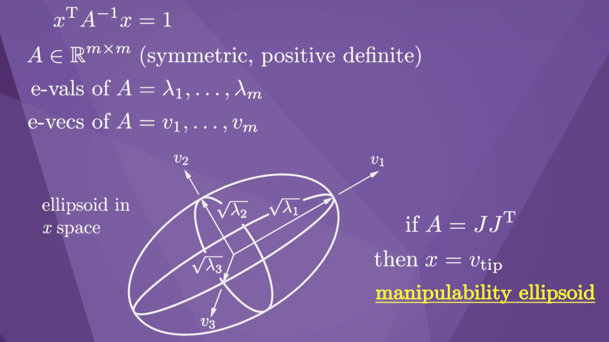

* 若$A=(JJ^T)^{-1}$，则$x=f_{tip}$，A称为force ellipsoid
* manipulability ellipsoid与force ellipsoid具有相同的主轴，且主半轴的长度是彼此的倒数，也就是说，在能够具有较大速度的方向上只能施加较小的力，而能够施加较大力的方向上只能具有较小的速度

我们不仅可以用可操作度椭圆来表示末端执行器的运动能力，还可以指定一个标量数值来表示机器人与奇异位形的接近程度，也就是manipulability measure

* 该数值越大，机械臂越接近奇异位形

* 该数值与可操作度椭球的体积成正比
* 可操作度椭球的体积变大，力椭球的体积就变小

* 物体雅可比矩阵可分为$3\times{}n$的角速度雅可比矩阵和$3\times{}n$的线速度雅可比矩阵
* 使用角速度雅可比矩阵可生成角速度可操作度椭球和力矩椭球
* 使用角速度雅可比矩阵可生成线速度可操作度椭球和线性力椭球

##Chapter 6

1. 闭环解析解

* 二连杆开链机械臂的逆运动解算，有多个解

2. 数字解——Newton-Raphson法

* 假设$\theta_d$是标量时，设角度初始值为$\theta^0$，角度期望值为$\theta_d$
* 求正运动函数$f$在$\theta=\theta^0$时关于$\theta$的偏导，可算出下一个迭代的$\theta$值$\theta^1=\theta^0+\Delta\theta$
* 一直重复这个步骤，则最终$\theta$会无限接近于$\theta_d$
* 注意：这种方法只能找到一个局部最优解

* 为了将牛顿-拉夫森法推广到关节向量和端点坐标，而不仅仅是标量，可在$\theta_d$附近写出$f(\theta)$的泰勒展开式，其中$\theta^i$是解的当前估计
* 当雅可比矩阵可逆时则可求出$\Delta\theta$

* 当雅可比矩阵不可逆（非方阵或奇异阵），可引入雅可比矩阵的伪逆
* 伪逆具有如下性质：如果方程（1）有多个解，例如机械臂是冗余的，那么伪逆可以找到所有解中的长度最小的解$\theta^*$，即关节值的变化量会尽可能小；如果机械臂处于奇异点或是没有足够的关节来满足方程（1），则使用伪逆求出的$\theta^*$，可使方程（1）
误差最小化

总体步骤如下

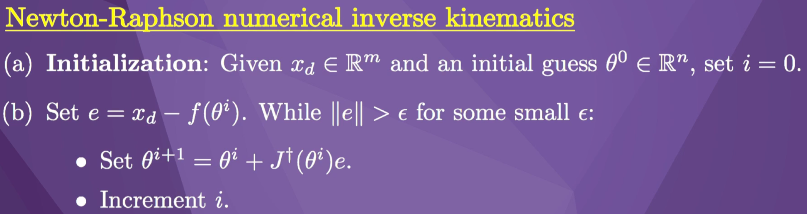

3. 数字解——Newton-Raphson法（基于变换矩阵）

将上述方法的$x_d$换为$T_{sd}$，以便用变换矩阵来来描述末端位形

* {d}坐标系是期望变换矩阵，{s}坐标系是空间坐标系，{b}坐标系是迭代接近{d}过程中其中一个变换矩阵
* 由于上一讲的e是位置的误差，故可看成是速度，所以这里也需要用一种类似速度的表示，而这里的$V_b$就相当于速度e

总体步骤如下：

* 这里的$V_b$、$J_b$都是基于{b}坐标系的，也就是物体运动旋量和物体雅可比矩阵

* 上述公式表示逆向速度运动学
* 运动旋量和雅可比矩阵的参考系保持一致

##Chapter 7

闭环运动学

* 并联机器人：一种特殊的闭链机器人，通过一组驱动腿将基座与移动平台相连

* 开链机械臂的每个关节都需要对抗全部的末端力，故负载能力相对较弱，关节和连杆的灵活性较强
* 并联机器人具有较强的负载能力和刚度，其末端负载力可以分散到各个支腿上
* 开链机械臂的正运动学较容易求出，但逆运动学通常有多个解
* 并联机器人的正运动学通常有多个解，但逆运动学通常较容易求出

Stewart机器人的逆运动学解算

闭链机器人的正运动学解算

* 正运动学解算涉及到多个非线性方程，故会产生多个解
* 如上图所示，同样的关节伸长长度，会使闭链机器人的末端产生不同的位形，这只是6个解中的其中2个解

##Chapter 8

本章节主要研究开链机械臂的动力学，正向解算和逆向解算分别如下

1. 拉格朗日公式法

$$L(\theta,\dot{\theta})=K(\theta,\dot{\theta})-P(\theta)$$

* 其中K是动能，P是势能，拉格朗日公式就是两者之差

$$\tau=\frac{d}{dt}\frac{\partial{}L}{\partial{}\dot{\theta}}-\frac{\partial{}L}{\partial{}\theta}$$

* 关节力和关节力矩$\tau$，等于L相对于$\dot{\theta}$偏导数的时间导数，减去L相对于$\theta$的偏导数

以2R机器人为例，求其关节力矩

* 假设机器人的质心集中在关节上，其质量分别为$m_1$和$m_2$
* 通过几何解析，求出第一个关节的坐标，并求出其速度（坐标点关于时间的导数）

* 同样的，可以求出第二个关节

* 紧接着就可以利用上述求出的关节速度，来求出两个关节的动能

* 接着是两个关节的势能，在这里由于没有弹簧装置，所以只需考虑重力势能

* 最后可写出拉格朗日公式，是两个关节的动能减去势能的和
* 对每个关节的力矩分别计算，求出关节力矩（$\tau_i$和$\theta_i$分别是第i个关节的力矩和关节角度）

* 最后求出的力矩如上
* 由于每个力矩都可以分为三部分，分别是（1）包含关节角加速度的部分；（2）包含关节速度的乘积；（3）不包含关节角加速度和关节速度，故一个力矩表达式可表示如下

* 分别是（1）质量矩阵部分；（2）速度乘积项；（3）重力项
* 另外还可以加上环境力项，$F_{tip}$是末端执行器作用于环境的力旋量

2. 拉格朗日公式中的速度乘积项

* 含有单个关节速度的平方的项是向心项（centripetal terms）
* 含有两个不同关节速度乘积的项是科里奥项（coriolis terms）

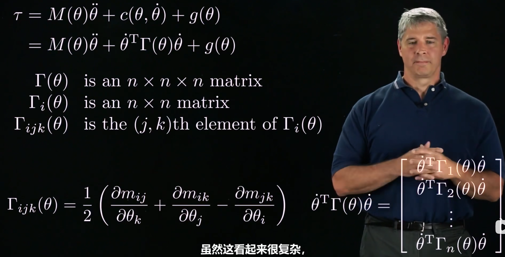

* 可以将速度乘积项表示为$\dot{\theta}^T\Gamma(\theta)\dot{\theta}$，且$\Gamma(\theta)$仅依赖于$\theta$
* $\Gamma(\theta)$是一个$n\times{}n\times{}n$的矩阵，称为质量矩阵的Christoffel符号

* 还有一种是将速度乘积项表示为科里奥利矩阵和关节速度向量的乘积

* 也可以把不依赖于关节加速度的所有项都归为一个单独的向量$h(\theta,\dot{\theta})$
* $c(\theta,\dot{\theta})$是$n\times{}1$的向量，$\Gamma(\theta)$是$n\times{}n\times{}n$的张量，$C(\theta,\dot{\theta})$是$n\times{}n$的矩阵，$h(\theta,\dot{\theta})$是$n\times{}1$的向量

3. 理解质量矩阵

* 机械臂的动能计算公式如上
* 质量矩阵一定是对称正定的，且它的值取决于关节角度

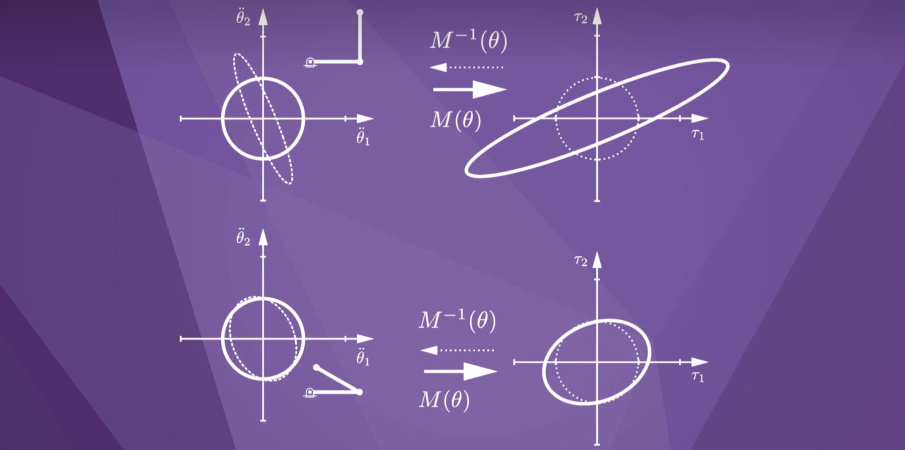

* 关节空间的一个加速度圆通过质量矩阵映射为一个关节力矩的椭圆，在这个关节力矩椭圆上在某些方向实现同样的加速度，需要比其他方向更大的力矩
* 椭圆的主轴方向由质量矩阵的特征向量决定
* 如果改变机械臂的结构，椭圆的形状也会随之变化

在关节空间上的上述椭圆仍不够形象，我们现在讨论笛卡尔空间（末端空间）

* 当人用手抓住机器人末端往不同方向拉动时，会感受到不一样的“笨重”程度，将其称为有效末端质量
* 其实就是笛卡尔空间上的质量矩阵，计算公式如上面黄色方框所示

* 末端空间的一个线性加速度圆通过有效质量矩阵映射为一个末端力的椭圆，在这个末端力椭圆上在某些方向实现同样的末端线性加速度，需要比其他方向更大的力

4. 单刚体动力学

为接下来的牛顿-欧拉法提供理论基础

* 一个刚体的质心的定义为，以[b]为参考系，所有质点的质量加权向量和为0，即$\sum_i{}\bold{m}_ip_i$
* 定义刚体的运动旋量为$V_b$，参考系为[b]
* 刚体中某质点的线速度$\dot{p}_i$和线加速度$\ddot{p}_i$如上
* 刚体中某质点的力$f_i$和力矩$m_i$如上，其中中括号表示叉乘
* 当物体以运动旋量$V_b$运动时，以$\dot{V}_b$加速物体所需的力$F_b$，是单个质点所需力和所需力矩的总和
* 惯量矩阵$I_b$是每个质量乘以其括号位置向量的平方的相反数之和

* $I_{xx}$成为x轴的惯性矩，质量$\bold{m}_i$离x轴越远，其惯性也就越大，绕x轴加速就需要更多的力矩，到x轴的距离也就是$y^2_i+z^2_i$

* 当用连续的质量代替单个质点后，就变成了积分问题
* $I_b$是对称正定矩阵

* 对于一个椭球形状的刚体，当选择的参考系不同时，惯量矩阵的复杂程度也不同
* 如果非对角元素为0，那么[p]的坐标轴成为惯性主轴，对称轴上的元素称为主惯性矩
* 通过计算$I_b$的特征向量和特征值，就可以求出$I_p$
* 通过$旋转矩阵R_{bp}$就可以实现惯量矩阵的转化

接下来将对刚体动力学方程表示为类似于纯旋转运动方程的形式

* $G_b$为空间惯量矩阵，对称且正定
* 刚体的动能是旋转动能和线性动能的和

* 由上述的转换，刚体动力学方程可表示为上图

* 在不同参考系下的表示如上
* 其中$G_a=[Ad_{T_{ba}}]^TG_b[Ad_{T_{ba}}]$

5. 牛顿-欧拉公式

正向迭代：已知关节角度、关节角速度、关节角加速度，求各个连杆质心的运动旋量和运动旋量速度

逆向迭代：由正向迭代求出的运动旋量和运动旋量速度，求出各个关节的力旋量和力矩

具体计算公式如下

* 其中$A_i$是关节i的在坐标系{i}中表示的螺旋轴
* $G_i$是连杆i的$6\times6$的空间惯量矩阵

6. 开链正向动力学

* 正向动力学指给出关节力矩$\tau$，求出各关节角加速度$\ddot{\theta}$
* 可以使用逆向动力学算法来求正向动力学
* 将$\ddot{\theta}$设为0，则逆向动力学算法求出的$\tau=c(\theta,\dot{\theta})+g(\theta)+J^T(\theta)F_{tip}$，即已求出$c(\theta,\dot{\theta})+g(\theta)+J^T(\theta)F_{tip}$
* 依次对每个关节角加速度$\ddot{\theta}_{i}$设为1，其余关节角加速度设为0，所有关节速度、重力加速度、末端力旋量都设为0，则可求出$M_{i}(\theta)$，最终可拼接成$M(\theta)$

7. 任务空间动力学

8. 约束动力学

* 可将机器人的位形约束写为向量方程，这些位形约束使白板擦一直也在板上
* 也可将对b求$\theta$的偏导写为偏导矩阵A的形式，k表示机器人n个关节上的k个速度约束

* 关节力矩可分为驱动机器人的分量和对抗约束的分量
* 由于约束不做功，对抗约束的力矩与关节速度的积为0
* 由于$A(\theta)\dot{\theta}=0$，约束力矩必然是矩阵A各行的线性组合，$\lambda$为拉格朗日乘子向量

* 定义$n\times{}n$投影矩阵P来消除拉格朗日乘子
* P将关节力矩$\tau$投影到驱动机器人的关节力矩上，从而消除了只对抗约束而不形成运动的关节力矩

##Chapter 9

1. 点到点轨迹

* 与时间有关的机器人配置的函数，称为机器人的轨迹（trajectory）
* 与路径参数s有关的机器人配置的函数，称为机器人的路径（path），s由0递增到1，分别对应起点和终点的时刻
* 通过时间尺度可将t转化为s

现考虑不同空间下的直线路径

* 关节空间上的直线路径

* 笛卡尔空间上的直线路径

* 恒定运动旋量下的螺旋轴路径

* 分离旋转和位移后下的直线路径

2. t 到 s 的转换

一种较为普遍的转换方法是将t到s的函数定义为三次多项式

* t-s的曲线是三次曲线，t-$\dot{s}$的曲线是抛物线，t-$\ddot{s}$的曲线是直线

3. 经过中间点的三次多项式轨迹

* 将三次多项式应用到机械臂关节的轨迹规划中，如上图所示
* 和时间转换的三次多项式相同，也有着4个terminal constraints，分别是起点和终点的位置和速度
* 上图的路径经过了4个via points，包括起点、终点和2个中间点，对于每两个via points间中的每个关节，都需要有1个三次多项式、4个terminal constraints和4个参数

* 为了解决上述给出太多constraints造成的关节角加速度不连续的问题，同时减小计算量，可不用保证上述4个限制，只需保证经过via point前和后的关节角速度和关节角加速度保持相等即可

4. 时间最优的时间尺度

* 时间最优的时间尺度定义如上
* 找到单调递增且二次可微的时间尺度s，满足映射[0,T]→[0,1]
* 限制(a)是与前面一样的terminal constraints
* 限制(b)是考虑机械臂动力学的限制，由于关节执行器所能输出的力矩有限，所以时间尺度的变化不能无限快

下面是$L(s,\dot{s})$和$U(s,\dot{s})$的定义

##Chapter 10

1. 运动规划概述

* 机器人的配置可表示为各关节角度的集合
* 这个空间叫做构位空间（C-space），构位空间由机器人能够自由运动的构位和机器人会发生碰撞的构位组成

* 运动规划可细分为考虑以下五种问题
* 有时间限制（trajectory）还是没有时间限制（path）
* 各关节的执行器输出有无限制
* 在线规划还是离线规划
* 最优化还是完成目标即可
* 精确到达目标点还是靠近目标点即可

* 运动规划器也可细分为以下三种属性
* 多个要求或是单一要求
* 运动规划的准确率和找到解的概率
* 计算时间和空间复杂度

2. 障碍物在构位空间上的表示

* 如图是一个二关节平面机械臂，其关节角度$\theta_1$和$\theta_2$可表示为左图，注意由于其构位空间实际是环面，而在这里是在正方形上表示，所以正方形的左右边界、上下边界实际是连通的
* 在构位空间上的三个障碍物分别可在正方形中表示，其覆盖区域表示当机械臂的构位配置在此点时，就会碰上障碍物
* 正方形中有四个连通区域，机械臂的运动规划只能在同一个连通区域上规划，否则必然会碰上障碍物
* 正方形中显示了由某起点到某终点的运动规划路径，路径中的点都位于同一个连通区域

* 障碍物通常模型是很复杂的，为了简便，可用若干椭圆来组成障碍物，然后计算这些椭圆到机械臂之间的距离，来检测障碍物
* 随着建模越精细，使用的椭圆越多，障碍物识别会越不保守，计算时间也会越长

3. A*算法——已学习过，Dijkstra算法加多了一个与终点有关的指标

4. 完全路径构建

* 虚线的图形为构位空间的障碍物，分别为一个三角形和一个矩形
* 假设移动机器人是一个正方形，其参考点位于正方形的左下方，将其在障碍物附近扫描，可以构建出灰色的构位空间上的障碍物
* 将构位空间的障碍物的点、起点、终点用直线连接起来，就形成了roadmap，也就是图，对这张图使用A*算法，就可以求出全局的、最短路径，如绿色实线所示

5. 离散路径构建

* 将构位空间离散化表示为方格的形式

6. 采样方法建立构位空间——PRM

由于要构建完全正确真实的roadmap复杂，我们可以使用采样的方法逼近真实的roadmap

* 这种方法在空间上随机选取若干点，再对每一个点与其相邻点连接边，从而构建出概率路图
* 采样点的数量越多，roadmap就越准确

* 具体步骤如上

7. 采样方法建立构位空间——RRT

* 从起点出发，像树一样伸展开来的寻找到终点的路径的方法
* 迭代地，我们需要随机采样一个点x_samp，然后找到现在RRT中距离x_samp最近的一个点x_nearest，再利用简单的路径规划器（如直线路径规划器）由x_nearest朝着x_samp的方向规划，找到一点x_new
* 如果x_new不在障碍物中，则加入到RRT，如果x_new在x_goal的邻近区域内，则认为找到了起点到终点的一条路径

* 具体步骤如上

* 上述步骤中的行3和4十分重要，要是只是随机取点然后直接加入到RRT中，就会出现右图这种现象，RRT拓展很慢

* 值得注意的是，RRT找到的并不是最优路径，而是一条可到达终点的路径而已，要找到相对较优的路径，则在算法中找到终点后仍不停止，而是继续拓展RRT，直到路径较优
* 也可以使用改进的RRT算法——RRT*

> [RRT* CSDN](https://blog.csdn.net/yuxuan20062007/article/details/88843690)

8. 人工势场法

* 吸引力，由目标点产生
* 通过吸引势场P进行反梯度下降求导，可得到吸引力F

利用吸引力F，有三种控制算法

* 第一种算法是直接将控制力矩置为吸引力，但不会收敛到目标点，故不采用
* 第二种是增加了阻尼项，最终会收敛
* 第三种是直接对关节角速度赋值为吸引力

* 斥力，由障碍物产生
* 因此，机器人收到的合力就是目标点产生的吸引力和各个障碍物产生的斥力的总和

* 但是，除了目标点这个全局最小点，还有一些鞍点，也就是局部最小点，机器人可能困在这些鞍点而无法到达真正的目标点
* 后续仍要改进算法以走出鞍点
  * 调整虚拟势场函数的参数：虚拟势场算法中的虚拟势场函数包含一些参数，如斥力系数、引力系数等。调整这些参数可以改变虚拟势场的形状和作用方式，从而影响机器人的路径选择和避障效果。
  * 引入随机性：在算法中引入一定程度的随机性，例如在选择路径时加入一定的随机扰动，或者在计算虚拟势场时采用随机化的方法来生成障碍物位置和大小等参数，这样可以使得算法更具有探索性，避免陷入局部最小值。
  * 多次尝试：尝试多次运行虚拟势场算法，每次从不同的起点出发，或者采用不同的参数设置和随机扰动等方法，以获得更全面的路径规划信息，并选择最优路径。
  * 结合其他算法：将虚拟势场算法与其他路径规划算法结合使用，例如A*算法、Dijkstra算法等，可以利用它们的全局优化能力来解决虚拟势场算法陷入局部最小值的问题。 

9. 非线性优化问题

* 我们可以将机器人路径规划问题转化为非线性优化问题，如上所示

* 一种可行非线性优化方法叫做shooting，即通过设计控制力矩u和时间变化T，从而得到轨迹q(t)，它是一种迭代更新的算法
* 首先我们给出一个初始的猜测的虽时间变化的路径，然后对这条路径上位于障碍物中的点进行反梯度下降计算，将这些点拉回到障碍物外面去，同时也将最后终点拉回到目标点上，经过一次次迭代后，会得到一条最优化的轨迹

##Chapter 11

1. 机器人控制框图

2. 误差响应

* 设机械臂的期望关节角度为$\theta_d(t)$，真实关节角度为$\theta(t)$，那么关节角度误差为上述两者之差
* 误差响应是指当初始误差为1的误差随时间的变化

* 某控制器作用下的单位误差响应如上，
* 当经过足够长时间后，误差会靠近0但是一个不为0的常数，我们称它为静态误差
* 还有如超调量和调节时间等属性
* 一个好的控制器要做到的是静态误差为0或足够小，没有超调量和震荡，且调节时间足够小

3. 线性误差动态方程

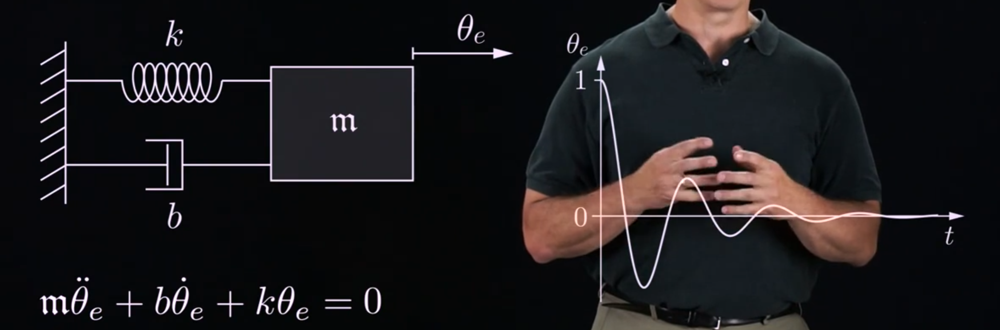

* 二阶的线性误差动态方程可表示为质量-弹簧-阻尼系统，假设用手将物块向左推$\theta_e$厘米，然后释放手，这时相当于系统的误差为$\theta_e$，物块会震荡，最后会回到初始位置
* 弹簧系数k相当于pid中的p，会让误差减小速度加快，阻尼b相当于pid中的i，减少了超调和震荡，于是加上物块加速度，就可以表示为左下角那个公式，m可认为是pid中的d

* 线性误差动态方程也可以表示成更高阶的如上所示

* 求出这个方程的解$x(t)$，也就解出了误差
* 我们可以看到A的特征值的实部小于0时，由$x(t)=e^{At}x(0)$可知，误差动态方程才是稳定的

#####一阶线性误差动态方程

* m=0时的公式，$b\dot{\theta}_e+k\theta_e=0$

#####二阶线性误差动态方程

* 当m不为0时，质量-弹簧-阻尼系统就是一个二阶系统
* 两边同时除以m即可得到误差动态方程

* 求出误差方程的解，分析$\zeta$的值
  * 当$\zeta>1$时，为过阻尼系统
  
  * 当$\zeta=1$时，为临界阻尼系统
  
  * 当$\zeta<1$时，为欠阻尼系统
  

4. 速度运动控制

设定机器人期望的关节角速度，要使机器人能够获得这个期望角速度，最开始的想法就是

$$\dot{\theta}(t)=\dot{\theta}_d(t)$$

这是一个开环控制，当机器人关节存在误差时，该控制算法无法消除误差

#####P控制

* 引入关节角度误差来控制关节角速度，形成了闭环控制
* 下面分析误差的动态变化
  * 定点控制（$\dot{\theta}_d=0$），可看出能够实现无误差控制，且P越大，误差减小的越快，但同时也要考虑关节执行器的限制
   
  
  * 恒期望关节速度控制（$\dot{\theta}_d=c$），多了一个常数项，但P控制无法消除这个静态误差
  

#####PI控制

* 对于恒期望关节速度控制，使用PI控制可以消除静态误差，具体是引入了一个积分项
* 从最后一个公式可看出，Kp相当于是质量-弹簧-阻尼系统的阻尼系数，ki相当于弹簧系数

* 从图中可看出，PI控制确实可消除静态误差

* 以上就是PI控制的控制框图
* 为了无需等待误差积累才开始对机械臂进行控制，引入了前馈项$\dot{\theta}_d$，从而使得误差为0的时候，仍然有控制命令$\dot{\theta}_d$，而不是要等到误差不为0才反应过来

#####任务空间的PI控制

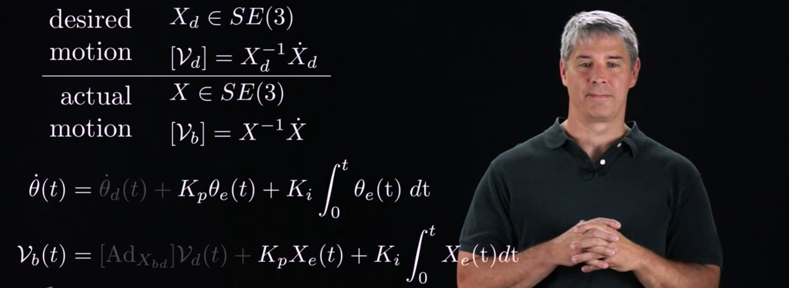

* $X_{bd}=X_{bs}X_{sd}=X^{-1}X_{d}$
* $[X_e]=logX_{bd}=log(X^{-1})X_{d}$

* 先算出运动旋量，之后通过雅可比矩阵可得出各个关节的关节速度

* 当X中的旋转和平移分开考虑时，如上述公式

5. 力矩运动控制

* 上述只是控制关节角速度的变化从而控制运动，在这里要更本质地讨论控制运动，即使用力矩来控制
* 下面的公式就是PID控制算法

* 这就是PID控制的控制框图

#####PD控制

* 当我们设Ki为0，则PID控制退化为PD控制
* 并且假设机械臂不受重力的影响，并将$\theta=\theta_d-\theta_e$代入，则可得到闭环控制方程
* 当$K_d>-b$且$K_p>0$时，系统稳定

#####PID控制

* 当考虑重力的时候，PD控制会存在静态误差

* 所以引入积分项，可得到一个三阶的闭环控制方程
* 但是对于三阶的闭环控制，不仅需要满足$K_d>-b$、$K_p>0$和$K_i>0$，还需要$K_i<\frac{(b+K_d)K_p}{M}$
* 三阶和二阶有所不同，Ki不仅仅要大于0，还不能无限大，否则仍然会造成不稳定
* 所以，机械臂的力矩控制器一般不加入积分项或Ki取很小，因为在不确定动力学参数的情况下首先得保证系统稳定

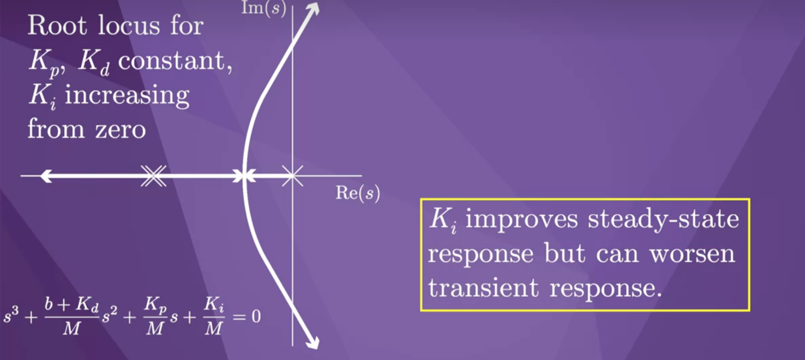

* 上方的根轨迹图就说明当Ki大到一定程度时，会位于坐标轴的右方，引来不稳定

#####计算力矩控制

* 尽管PID控制效果较好，但要它要求误差不为0才能起到控制效果，所以当我们能够估计到机械臂的动力学参数时，可以加入前馈项，再与之前的PID控制结合，就是计算力矩控制
* 它的控制效果比如比PID控制更好

* 上面就是闭环控制方程

* 上面是控制框图

* 基于任务空间的计算力矩控制如上，其中$[X_e]=log(X^{-1}X_d)$，$V_e=[Ad_{X^{-1}X_d}]V_d-V_b$

6. 力控制

机械臂的力控制是指控制机械臂末端与环境交互时的力受到用户的控制，加入外力的机械臂动力学方程如下$$\tau=M(\theta)\ddot{\theta}+c(\theta,\dot{\theta})+g(\theta)+J^{T}(\theta)F_{tip}$$由于一般机械臂与环境接触交互时都会保持静止，所以其关节角速度和角加速度都为0，故可去掉上述公式的第一和第二项

* 力控制的开环控制如上，其中$\tilde{g}$是估计的重力项，$F_d$是期望的接触外力

* 在机械臂末端安装力传感器，则可以实现力的闭环控制，上述就是PI控制的力控
* 不加入微分项D的原因是力传感器的噪声较大，对力微分并引入到控制中反而会方法噪声

7. 位置-力混合控制

* 如上图第一个公式定义了机械臂在某任务中受到的运动限制和力控制
* 末端输出力可分为两部分，分别为引起运动的力和引起接触力的力
* 通过矩阵P可以对$F_b$进行去耦合

* 上述就是位置-力混合控制，通过矩阵P将运动控制和力控制进行去耦合
* 例如，我们希望在x和y方向可以控制机械臂的运动，在z方向控制其接触力，假设P为$3\times3$的矩阵，则可以设置$P=[1,0,0;0,1,0;0,0,0]$，正好对应x和y方向，则$I-P=[0,0,0;0,0,0;0,0,1]$，正好对应z方向

##Chapter 12

1. 物体接触分析

* 其中d是两个为两个物体位置的距离，物体位置表示为$q_1$和$q_2$
* 上述就是分别讨论d、d的一阶微分和d的二阶微分的大小对应于两物体接触的情况

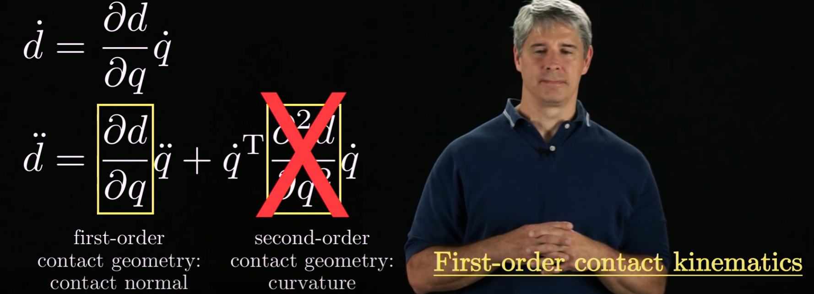

* 对d求一阶导和二阶导如上
* 其中$\frac{\partial{}d}{\partial{}q}$称为接触法线，是一阶接触几何，$\frac{\partial{}^2d}{\partial{}q^{2}}$为曲率，是二阶接触几何，在这里我们通常只考虑一阶接触几何

* 上述虽然与圆形接触的物体形状不同，但接触法线相同

2. 物体接触类型

* 物体A和物体B接触如上图，两者接触的接触法线为$\hat{n}$，两者的运动速度分别为$\dot{p}_A$和$\dot{p}_B$
* 我们可以使用公式$\hat{n}^T(\dot{p}_A-\dot{p}_B)$的大小来判断两者的接触状态
  * 当公式大于0时，两者开始远离对方，将不再接触，称为breaking
  * 当公式等于0时，两者保持接触但两者的平面可能仍存在摩擦或滑动，称为sliding
  * 当$\dot{p}_A-\dot{p}_B$等于0时，两者保持静止，接触面没有摩擦

* 我们可以用F来表示接触法线和接触力矩，表示为上上张图的右下方
* 那么可以用$F$代替$\hat{n}$，用运动旋量$V$来替代$\dot{p}$，得到上面的公式，分别表示了三种接触类型——breaking、sliding 和 rolling

* 现在看个例子，其中B物体保持静止，A物体可能会运动
* rolling状态：$V_A=0$，右下方图的原点就是表示R状态
* sliding状态：作接触法线F的垂直平面，垂直平面上的状态就是S状态
* breaking状态：垂直平面的右边部分，也就是F指向的部分，就是B状态

* 当B物体也运动时，则如上所示
* 这时候S状态不在原点了

对于一个物体，其位置表示为$X\in{}SE(3)$，故X有6个参数，对于S状态，有1个参数受到限制，对于R状态，有3个参数受到限制

3. 多个物体接触

* 多个物体接触，其接触为单个物体分别与六边形接触区域的交集

* 接触模式：多个接触物体的关联
* 其接触可认为是一个多面体的凸圆锥

* 现在考虑三个物体与六边形接触，当第三个物体是静止的时候，每个物体接触所形成的半空间的交集只有一个交点，这表示只要六边形一动，就会发生撞击

* 当第三个物体有一个速度时，它所对应的半空间会发生平移，从而交集不再只是一个点

4. Rotation Centers

* 如图，呈盆子形状的是机器人，三角形为与机器人接触的物体
* 我们定义rotation centers，指的是机器人以这个点作为螺旋轴产生运动旋量，默认绕螺旋轴的旋转方向都是逆时针
* 从图可以看到，当rotation centers位于灰色区域时，机器人与物体的接触模式为breaking
* 当rotation centers位于虚线上，接触模式为sliding
* 当rotation centers位于实点上，接触模式为rolling

* 对于三个接触物体时情况如上，灰色部分是三个接触物体的灰色区域的交集
* 根据之间判断接触模式的方式（接触点为R，实线上为S，实线向接触法线方向部分为B），可以分别得到各个接触物体的接触模式，最右边的图就是分别得出的结论后一个简单的交集
* 如rotation centers点SrBSr为例，对于第一个接触物这个点会导致接触模式为S，且方向是right，对于第二个接触物则为B，对于第三个接触物则为S，且方向为right，故最后合在一起就是SrBSr

* 但是，对于这个rotation center，实际情况并不是这样的，接触物3会和机器人进行碰撞，因此判断结果SrBSr不正确
* 这是因为我们只是进行了first-order analysis，也就是只以接触法线作为判断依据，没有考虑second-order analysis，也就是没有考虑曲率
* 所以，我们首先进行first-order analysis，当判断结果为breaking时，则可实际情况也是break，当判断结果为sliding或是rolling时，则仍需进行second-order analysis

5. 形闭合（form closure）

* 形闭合为使用若干接触物来固定住一个物体不能动弹
* 对于first-order analysis下的形闭合，平面图形至少需要4个接触物才能实现，空间物体需要至少7个接触物才能实现

* 上面是first-order analysis下的形闭合的例子

* 上面是更高阶analysis下的形闭合，虽然在first-order analysis下他被判断为form closure，但是他实际上并不胡，这时候就需要更高阶的分析
* 总结：如果一个物体在first-order下被判断为form closure，那么他在更高阶下判断也为form closure；但如果一个物体在first-order下被判断为sliding或rolling，那么他在更高阶下判断可能却是form closure

6. 摩擦力

7. Moment labels

* 如图，两个接触物的moment labels的正号区域的交集如上
* 这个交集说明，==可以产生任意一个在该交集外面，且方向是围绕交集逆时针的外力或外力旋量==，也可以使用右手定则，拇指指向力旋量方向，四指螺旋，如果这个螺旋方向在正号区域是由屏幕朝外的，在负号区域是由屏幕朝里的，则这个力旋量可以产生

* 上面这个绿色的外力旋量也可以产生

* 由于这个力旋量是围绕交集顺时针的，所以不能由这个交集产生

* 由于这个力旋量穿过交集，所以也不能由这个交集产生

1. Force closure（力闭合）

* 力闭合就是有若干接触物与物体接触，当有一个新的力作用在物体上时，无论这个力的方向或大小，由于接触物与物体接触产生的摩擦力的作用，这个物体都不会受这个新加的力而运动

* 使用上一节所说的moment label方法分析，由于这个外力external wrench穿过了负号区域，故接触物与物体之间不能产生与这个外力相反方向的力来与之抵消，也就是不能产生红色箭头的力

* 当两个接触物的moment labels相互抵消后，则无论外力的方向和大小，都可以产生resisting wrench与之抵消，达到力闭合

9. 力的自由度和运动的自由度的二元性

10. manipulation with a ruler

* 若忽略加速度和速度时，即接触物体保持静止，该公式等号右边为0，此时称为准静态（quasistatic assumption），之后我们一般在准静态下讨论

下面讨论用两个手指拖着一把直尺，手指的运动对与直尺接触的影响（且==右边手指距离直尺质心更近==）

* 当两个手指保持静止时，用右手定分析重力的抵消力mg，可知螺旋在左边是由屏幕朝外，在右边是由屏幕朝里，符合这个moment label，故mg可由两个手指产生，故直尺保持静止

* 当手指离开直尺，即breaking时，整个平面都是plus-minus，这时候mg不能被产生

* 当左边手指静止，右边手指向左滑动时，由于mg穿过负号区域，故mg也不可被产生

* 当两个手指都往直尺质心方向滑动时，由于mg也穿过负号区域，故mg不可被产生

* 当左边手指向左滑动，右边手指静止时，由于mg没有穿过正号区域，且符合右手定则，故mg可被产生

##Chapter 13

1. 移动机器人的运动学分析

以安装有四个麦克纳姆轮的移动机器人为例

* 其中$\phi$、$x$、$y$是在世界坐标系下，移动机器人底盘的旋转角速度、x轴和y轴方向的线速度，他们组合起来再取微分，接着左乘转换矩阵，就是移动机器人在移动机器人底盘坐标系下的的运动旋量

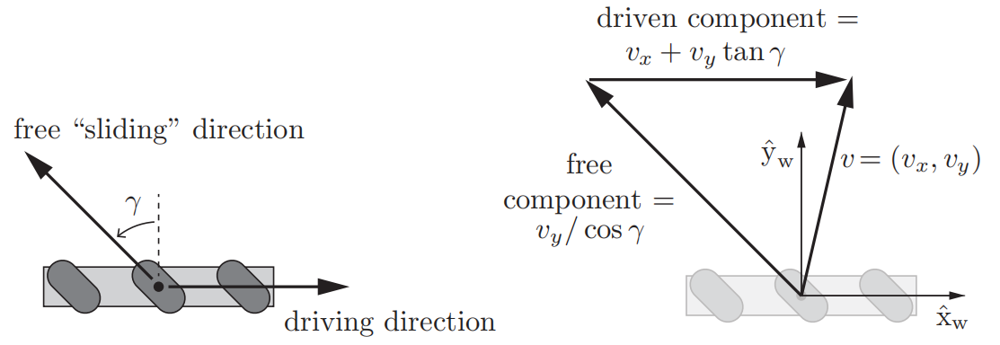

* 对于一个麦克纳姆轮中的一个组件小轮子，有两个运动方向，分别为driving方向和free sliding方向
* 这两个方向的速度矢量所组成的矢量和$v=(v_x,v_y)$，就是麦克纳姆轮在其自身坐标系下的总体运动趋势的速度矢量

* 根据上面的图分析，$v$的可计算如上

* $u$是麦克纳姆轮的转速
* 转速等于线速度除以轮子半径

* 上面的图包含三个坐标系，分别为世界坐标系{s}，移动机器人底盘坐标系{b}，麦克纳姆轮坐标系{w}

* 在已知移动机器人在世界坐标系下的旋转速度和线速度（也就是运动旋量）下，求每一个麦克纳姆轮的转速的公式如上
* 该公式后面两项，将运动旋量由坐标系{s}转为坐标系{b}，也就是$V_s$→$V_b$
* 该公式后面三项，将$V_b$转为坐标系{b}下的线速度
* 该公式后面四项，将坐标系{b}下的线速度转为坐标系{w}下的线速度
* 该公式后面五项，将坐标系{w}下的线速度转化为麦克纳姆轮的转速

* H包含了上述公式的前四项

* 要控制移动机器人，我们先设定期望$\phi$、$x$、$y$，再应用前馈+PI控制来输出控制命令$\dot{q}$，最后运用$u=H(\phi)\dot{q}$从而控制移动机器人

2. Non-Holonomic 建模

Non-Holonomic——如果可控自由度小于总自由度，则称为非完整驱动。一辆汽车有三个自由度；即它在两个轴上的位置和它的方向。然而，方向盘只有两个可控制的加速（或制动）和转弯角度的自由度。这使得司机很难将汽车转向任何方向（除非汽车打滑或滑行）

Holonomic——指机器人的可控自由度和总自由度之间的关系。如果可控自由度等于总自由度，则将机器人称为完整自由度。一个建立在蓖轮或全轮上的机器人是完整驱动的一个很好的例子，因为它可以自由地向任何方向移动，可控的自由度等于总自由度。

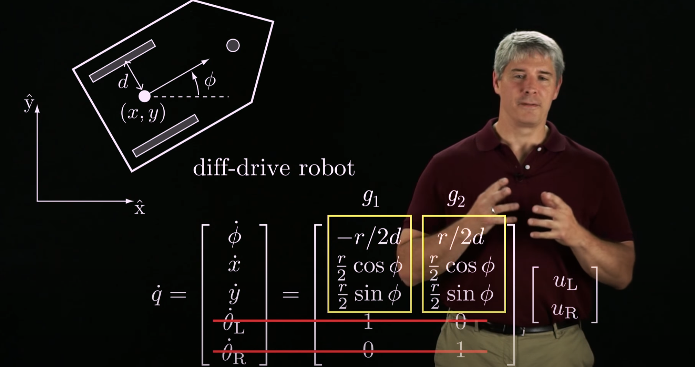

* 利用两轮子差速转向

* 利用阿克曼角原理转向

3. 轮式移动机器人的可控性

* 普通的P控制算法控制轮式移动机器人

* 线性可控性判断条件
* 当我们代入上面的P控制算法，要使得系统稳定，$A-BK$的特征值必须都有负实数

3. 可控性概念

* 直观地说，如果一辆车只能前进不能后退，那它就是STLA，而如果一辆车既能前进又能后退，那它就是STLC

4. 李括号（Lie Bracket）

* 一个Non-Holonomic的车先前进x米后后原地逆时针旋转y度，接着再后退x米后顺时针旋转y度，这个车并不会回到原地，而是距离原点偏移了（在这里是向右偏移）若干个李括号
* 这也说明了Non-Holonomic的速度的限制，并不会对configuration产生限制

* 分别对上次四次操作进行泰勒展开
* 最后完成四次操作后的$q(4\epsilon)$除了原点配置$q(0)$外还多了个李括号项$\epsilon^2[g_i,g_j]$，这也就是偏移原点的距离

5. Lie Algebra rank condition (LARC)

6. Non-Holonomic的路径规划

当车只能前进时

当车能前进和后退时

7. Non-Holonomic的反馈控制

* 为了定位到车的configuration，我们需要在车盘上找到一个点P，这个点P相对于车盘不动，且$(x_r,x_y)$是P点相对于车盘的坐标
* $(x_P,y_P)$是P点相对于世界坐标系下的坐标
* 那么就可以求出P控制算法

* 但是如果车盘坐标系{b}的原点任意确定，那么就会出现上图右边的情况——P点的位置得到控制了，但是车的方向确实不相同的

* 为了解决这个问题，我们必须明确把车盘坐标系{b}的原点确定为车的两个轮子的中间位置，这样子就可以求出期望configuration与实际configuration的误差$(\omega_e,x_e,y_e)$

* 最后的控制器如上，其中$\omega$就是$\dot{\phi}$，$(v\cos\phi,v\sin\phi)$为$(\dot{x},\dot{y})$

8. odometry

也就是通过传感器去测量该移动机器人的具体位置

* 步骤如上，最主要的是第三步，从移动机器人轮子的转动角度去推出机器人的运动旋量

下面是三种不同类型的移动机器人的运动旋量的推导

9. 移动机械臂的控制

* 移动机械臂可以建立四个坐标系——世界坐标系{s}、车盘坐标系{b}、机械臂基坐标系{0}和机械臂末端坐标系{e}，{b}和{0}通常可合在一起
* 其configuration可表示为$X(q,\theta)$，其中$q$包括$(\phi,x,y)$，$\theta$是机械臂关节角度

* 机械臂末端的运动旋量$V_e$如上
* 其中m是车轮数量，n是关节数量，u是车轮速度，$\dot{\theta}$是关节角速度
* $J_e$可分为两部分——车盘部分和机械臂部分
* 在机械臂末端坐标系下表示的机械臂末端的运动旋量，不受车盘位置的影响

* 上面是求车盘部分的雅可比矩阵

* 最后可推出PI控制算法
* 使用雅克比矩阵的伪逆，就可以求出控制运动旋量所对应的车轮速度和机械臂关节角速度